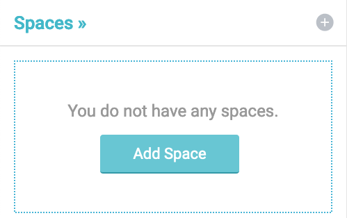
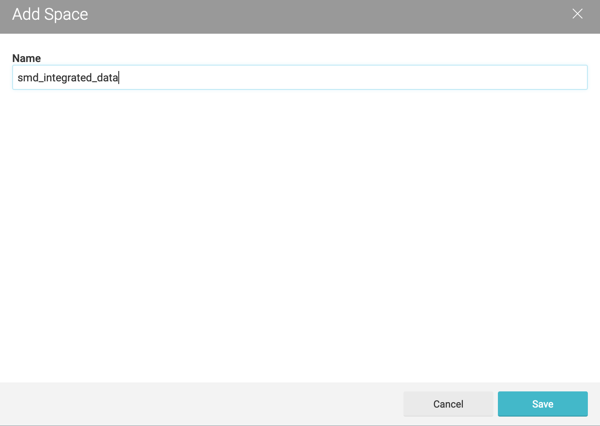

Tutorial "How to connect Dremio to Ontop"
=====================================================================================================

Inthis tutorial we present step-by-step the way of connecting Dremio to Ontop. We show how to integrate **in1** data saved in a PostgreSQL database and *uni2* data saved in plain JSON files into one Dremio data space. 

Before you proceed, we recommend you to see the following tutorials provided by Dremio:

  1. [Getting oriented with Dremio](https://www.dremio.com/tutorials/getting-oriented-to-dremio/)
  2. [Working with your first dataset](https://www.dremio.com/tutorials/working-with-your-first-dataset/)


As a first step, by following the instructions in [Working with your first dataset](https://www.dremio.com/tutorials/working-with-your-first-dataset/), we create a *space* named **integrated_university_data** as shown below:

 
 

It will be our data space in which we integrate data from various sources.

We add the *smd_use_case* database as the data source by again following the instructions in [Working with your first dataset](https://www.dremio.com/tutorials/working-with-your-first-dataset/).


Then for having plain JSON files as data sources, 

- we select **NAS** as new source type and enter the path of the folder in which the JSON source files locate. See the tutorial [Data curation with Dremio](https://www.dremio.com/tutorials/data-curation-with-dremio/) for more details.

- After saving ThreeLineSJI.json file as a dataset, it looks like the following:

 
 
JSON files usually contain nested data. However, Ontop can not directly query nested data. For this reason, in order to make our JSON data queryable by Ontop, first we need to extract relevant group of elements, and save these groups as datasets. 

We create a dataset *SJIeventHeader* by extracting some fields from *ThreeLineSJI.json* file with the following SQL query:

```sql
SELECT "ThreeLineSJI.json".eventHeader.eventId AS eventId, 
"ThreeLineSJI.json".eventHeader.eventName AS eventName, 
"ThreeLineSJI.json".eventHeader.eventVersion AS eventVersion, 
"ThreeLineSJI.json".eventHeader.eventTimestamp AS eventTimestamp
FROM "three-line-data"."ThreeLineSJI.json"
```


We extract the *SJImesLocation* dataset in a similar manner with the following SQL: 

```sql
SELECT "ThreeLineSJI.json".eventHeader.eventId AS eventId,
"ThreeLineSJI.json".mesLocation.mesLocationId AS mesLocationId, 
"ThreeLineSJI.json".mesLocation.mesLineNo AS mesLineNo,
"ThreeLineSJI.json".mesLocation.mesStatNo AS mesStatNo,
"ThreeLineSJI.json".mesLocation.mesStatIdx AS mesStatIdx,
"ThreeLineSJI.json".mesLocation.mesFuNo AS mesFuNo,
"ThreeLineSJI.json".mesLocation.mesWorkPos AS mesWorkPos,
"ThreeLineSJI.json".mesLocation.mesToolPos AS mesToolPos,
"ThreeLineSJI.json".mesLocation.mesProcessNo As mesProcessNo
FROM "three-line-data"."ThreeLineSJI.json"
```


We extract the *SJIprocessedPanel* dataset in a similar manner with the following SQL: 

```sql
SELECT "ThreeLineSJI.json".mesLocation.mesLocationId AS mesLocationId, 
"ThreeLineSJI.json".sjiProcessedPanel.panelId AS panelId, 
"ThreeLineSJI.json".sjiProcessedPanel.typeNo AS typeNo,
"ThreeLineSJI.json".sjiProcessedPanel.sjiProg1Name AS sjiProg1Name,
"ThreeLineSJI.json".sjiProcessedPanel.sjiSumFailures AS sjiSumFailures,
"ThreeLineSJI.json".sjiProcessedPanel.mesPanelProcessResult AS mesPanelProcessResult,
"ThreeLineSJI.json".sjiProcessedPanel.mesPanelProcessResultBit AS mesPanelProcessResultBit
FROM "three-line-data"."ThreeLineSJI.json"
```


JSON data usually contain arrays. Such arrays should be unnested first, before the relevant elements been extracted from the them.

We unnest the *sjiFailures* array in the *ThreeLineSJI.json* and extract the relevant element from it. So that we obtain the dataset *SJIfailures* by executing the following SQL:

```sql
SELECT panelId, 
F.sjiFailures.sjiFailureCode AS sjiFailureCode,
F.sjiFailures.boardNo AS boardNo,
F.sjiFailures.sjiTestAlgorithm AS sjiTestAlgorithm,
F.sjiFailures.sjiSystemName AS sjiSystemName,
F.sjiFailures.sjiScrapConfirmation AS sjiScrapConfirmation,
F.sjiFailures.sjiTestWindowNo AS sjiTestWindowNo,
F.sjiFailures.sjiComponentShape AS sjiComponentShape,
F.sjiFailures.componentPinNo AS componentPinNo,
F.sjiFailures.sjiFailureClassification AS sjiFailureClassification,
F.sjiFailures.referenceDesignator AS referenceDesignator
FROM (
SELECT "ThreeLineSJI.json".sjiProcessedPanel.panelId AS panelId,
flatten(sjiFailures) AS sjiFailures
FROM "three-line-data"."ThreeLineSJI.json") F
```

The unnesting process is expressed in the sub-query with the following expression: 

```sql
flatten(sjiFailures) AS sjiFailures
```

and the relevant fields are extracted at the projection part of the query as done before.


Now, all the datasets that are intended to be integrated are saved in the space **smd_integrated_data**. Recall that all the datasets prefixed with "SMD" are origined from the PostgreSQL database *smd_use_case*, and all the others prefixed with "SJI" are origined from the JSON file *ThreeLineSJI.json*.


Query optimization techniques implemented in Ontop are mostly based on key constraints. However, Dremio does not have the feature of defining primary/foreign keys over datasets. 

One can overcome this drawback by defining implicit key constraints via Ontop. All the primary/foreign keys that are required in *smd_integrated_data* can be defined as follows:

```
SMDeventHeader:eventId
SMDmesLocation:mesLocationId
SMDprocessedPanel:panelId
SMDprocessedComponents:referenceDesignator,boardNo

SMDmesLocation:eventId:SMDeventHeader:eventId
SMDprocessedPanel:mesLocationId:SMDmesLocation:mesLocationId
SMDprocessedComponents:panelId:SMDprocessedPanel:panelId

SJIeventHeader:eventId
SJImesLocation:mesLocationId
SJIprocessedPanel:panelId,typeNo,sjiSumFailures,mesLocationId
SJIfailures:boardNo,referenceDesignator,sjiTestWindowNo,panelId

SJImesLocation:eventId:SJIeventHeader:eventId
SJIprocessedPanel:mesLocationId:SJImesLocation:mesLocationId
SJIfailures:panelId:SJIprocessedPanel:panelId
```
The file in which the implicit constraints are saved should be suffixed with ".db_prefs". The name of the file should be the same with the name of the ontology file. Please see [this tutorial](https://github.com/ontop/ontop/wiki/Implicit-database-constraints) for more details about implicit key constraints.

Dremio can be connected to Ontop through its JDBC interface. By following the instructions provided in [here](https://docs.dremio.com/drivers/dremio-jdbc-driver.html), we provide  to Ontop the following JDBC connection information in a ".properties file" for a Dremio instance running on the localhost:

```
jdbc.url=jdbc\:dremio\:direct\=localhost\:31010;schema\=smd_integrated_data
jdbc.driver=com.dremio.jdbc.Driver
jdbc.user=dremiotest
jdbc.password=dremiotest
``` 
Dremio JDBC driver can be downloaded from [here](https://www.dremio.com/drivers/). 

Over an OBDA setting containing the following mapping assertions:

```
[MappingDeclaration] @collection [[
mappingId	09 - SJIFailureMappings-01
target		:SJIFailure/{boardNo}/{referenceDesignator}/{sjiTestWindowNo}/{panelId} 
            a :SJIFailure ; 
            :isFailureOf psmt:Component/{boardNo}/{referenceDesignator} . 
source		select distinct *  from SJIfailures

mappingId	23 - SMDProcessedPanelMappings-01
target		psmt:Panel/{panelId} psmt:hasBoard psmt:Board/{panelId}/{boardNo} . 
source		select distinct *  from SMDprocessedComponents

mappingId	26 - SMDBoardMappings
target		psmt:Board/{panelId}/{boardNo} psmt:hasComponent
            psmt:Component/{boardNo}/{referenceDesignator} . 
source		select distinct *  from  SMDprocessedComponents
]]
```
 we can execute the following SPARQL query,

```sparql
PREFIX psmt: <http://bos.ch/ae/smt/product#>
PREFIX fsmt: <http://bos.ch/ae/smt/failure#>

SELECT ?panel ?board ?component
{
 ?panel psmt:hasBoard ?board .
 ?board psmt:hasComponent ?component .
 ?failure fsmt:isFailureOf ?component .
}
LIMIT 10
```

and get the following result:

