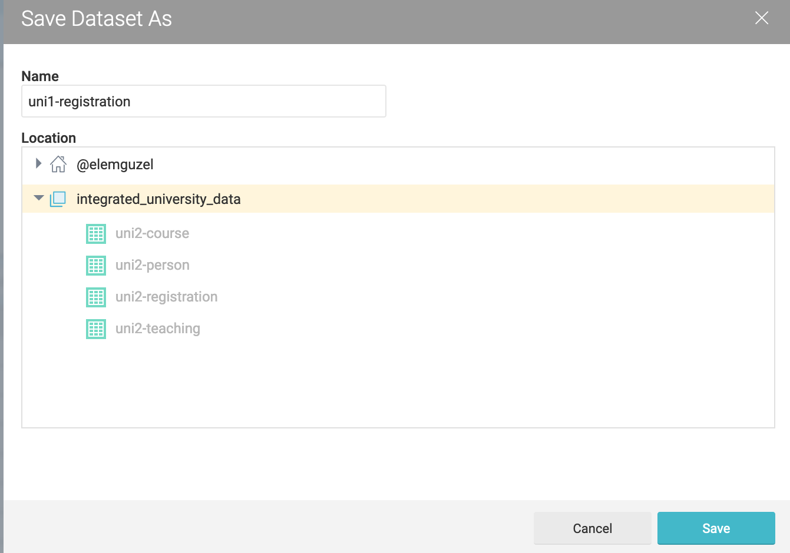
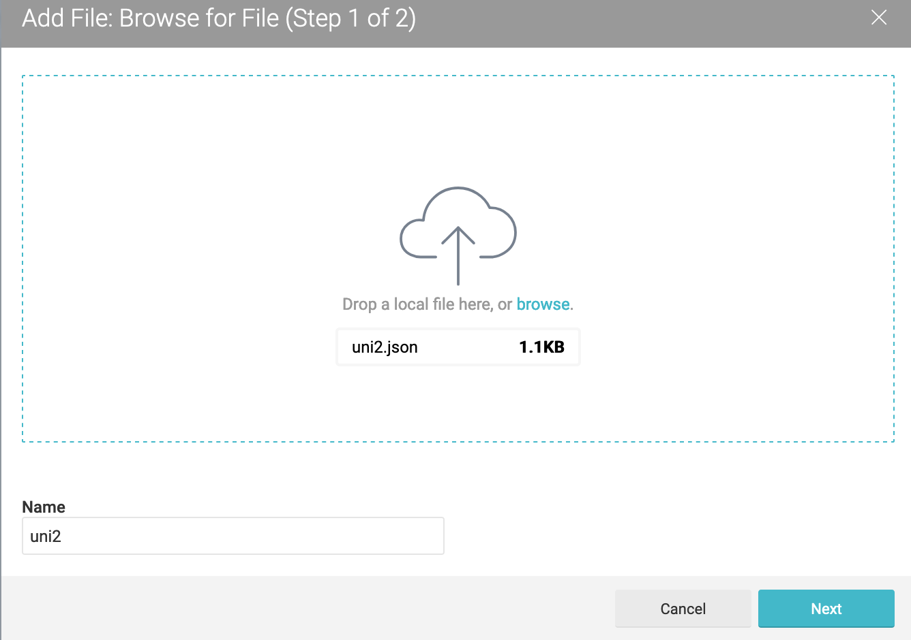

Tutorial "How to connect Dremio to Ontop"
=====================================================================================================

Inthis tutorial we present step-by-step the way of connecting Dremio to Ontop. We show how to integrate **uni1** data saved in the PostgreSQL database and *uni2* data saved in plain JSON files into one Dremio data space. 

Before you proceed, we recommend you to see the following tutorials provided by Dremio:

  1. [Getting oriented with Dremio](https://www.dremio.com/tutorials/getting-oriented-to-dremio/)
  2. [Working with your first dataset](https://www.dremio.com/tutorials/working-with-your-first-dataset/)


As a first step, by following the instructions in [Working with your first dataset](https://www.dremio.com/tutorials/working-with-your-first-dataset/), we create a *space* named **integrated_university_data** as shown below.

Add new data space:

 

Save the new data space:


It will be our data space in which we integrate data from various sources.

The *uni1* data is contained in a PostgreSQL database named *university-session1*. Either you can download the SQL script that generates the database from [here](data/postgres-docker/db/university-session1.sql) and load it to your local PostgreSQL server, or you can run the docker container that we provide by executing the following script:

```bash
IMAGENAME="university-db"
docker ps -q --filter ancestor=$IMAGENAME | xargs docker stop
docker build -t $IMAGENAME .
docker run -p 5435:5432 $IMAGENAME
``` 
 
The database *university-session1* becomes accesable with the following JDBC URL:

```sql
jdbc:postgresql://localhost:5435/university-session1?user=postgres&password=postgres
``` 

Now we are ready to add our database as a new datasource into Dremio:


Select PostgreSQL:


Enter the required JDBC information:


Now we see the tables in *university-session1*:


Save the tables as datasets into *integrated-university-data* space as follows:



Now we add the *uni2* data as a JSON data source:



The *uni2* JSON data can be seen as follows:


JSON files usually contain nested data. However, Ontop can not directly query nested data. For this reason, in order to make our JSON data queryable by Ontop, first we need to extract relevant group of elements, and save these groups as datasets. 

With the following SQL query we create an *uni2-registration* dataset and save it into integrated data space *integrated-university-data*:

```sql
SELECT T.cid, T.enrollers.pid AS pid 
FROM (
   SELECT cid, flatten(enrollers) AS enrollers 
   FROM uni2
) T
```

Create a dataset named *uni2-course* in a similar manner:

```sql
SELECT course, cid FROM uni2
``` 

Create a *uni2-person* dataset with a bit more involved SQL that contains both students and lecturers:

```sql
SELECT * FROM (
    SELECT uni2.lecturer."pid" AS pid, uni2.lecturer."fname" AS fname, uni2.lecturer."lname" AS lname 
    FROM uni2
    UNION ALL
    SELECT T.enrollers."pid" AS pid,T.enrollers."fname" AS fname, T.enrollers."lname" AS lnmae 
    FROM(
        SELECT flatten(enrollers) AS enrollers
        FROM uni2
    ) T
) F
ORDER BY pid
``` 

Finally create *uni2-teaching* dataset wit the following SQL:

```sql
SELECT cid, uni2.lecturer.pid AS pid
FROM uni2
```
